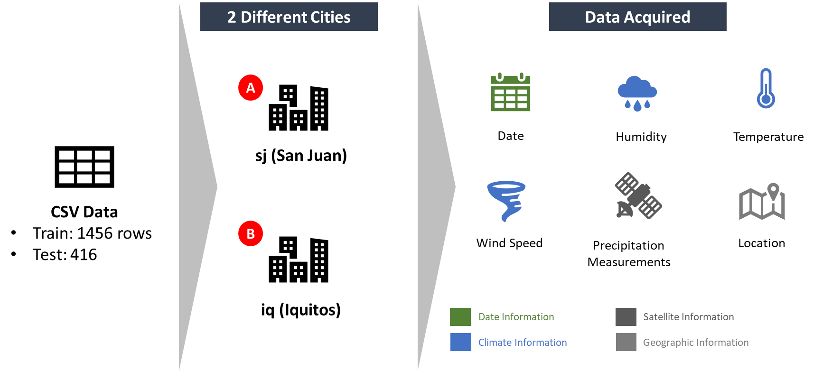

# DengAI : Predicting Disease Spread
Principle of Data Science-UM Master

It is a dengue prediction use case, where data from 2 cities, San Juan (sj) and Iquitos (iq) are given. We will use the data for analysis and also prediction of dengue cases. This use case is originated from the [DengAI](https://www.drivendata.org/competitions/44/dengai-predicting-disease-spread/) 

Data given descriptions are as below:

