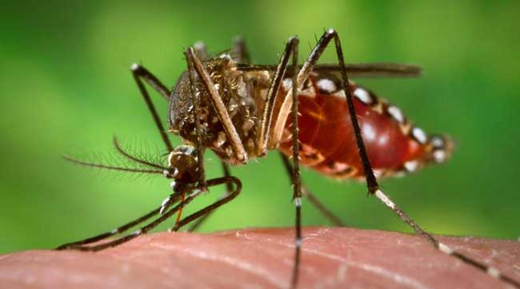

# DengAI : Predicting Disease Spread
Principle of Data Science-UM Master

It is a dengue prediction use case, where data from 2 cities, San Juan (sj) and Iquitos (iq) are given. We will use the data for analysis and also prediction of dengue cases. This use case is originated from the [DengAI](https://www.drivendata.org/competitions/44/dengai-predicting-disease-spread/).

<h2 style='margin:10px 5px'>Intitial Questions</h2>

<h3>1. Can we predict local epidemics of <b>Dengue</b> cases?</h3>

<b>Dengue</b> fever is a <code>mosquito-borne</code> disease that occurs in tropical and sub-tropical parts of the world. In mild cases, symptoms are similar to the flu: fever, rash, and muscle and joint pain. In severe cases, <b>Dengue</b> fever can cause severe bleeding, low blood pressure, and even death.

<h3>2. Can we gain deeper understanding on variables that will affect the <b>Dengue</b> cases?</h3>

Because it is carried by mosquitoes, the transmission dynamics of <b>Dengue</b> are related to climate variables such as temperature and precipitation. Although the relationship to climate is complex, a growing number of scientists argue that climate change is likely to produce distributional shifts that will have significant public health implications worldwide.

<h2 style='margin:10px 5px'>Overview & Motivations</h2>

The general overview of this project is to study <code>variables</code> affecting the <b>Dengue</b> cases and their weightage by analysing public data set regarding the DEN-V field. 

Our goal is to predict the <code>total_cases</code> of <b>dengues</b> for each <code>city</code>, <code>year</code> and <code>weekofyear</code> in the datset. There are 2 cities, San Juan, <b>sj</b> and Iquitos, <b>iq</b>, with the data spanning from period of 2001 to 2021.

<b> List of Features </b>
We are provided the following information on a <code>year</code> & <code>weekofyear</code> timescale:

1. <b>City & Date Indicators</b>
    - <code>city</code>: City abbreviations : <b>sj</b> for San Juan and <b>iq</b> for Iquitos
    - <code>week_start_date</code> : Date given in <b>yyyy-mm-dd</b> format
2. <b>PERSIANN satellite precipitation measurements (0.25x0.25 degree scale)</b>
    - <code>precipitation_amt_mm</code> : Total precipitation
3. <b>NOAA's (National Oceanic and Atmospheric Administration) NCEP Climate Forecast System Reanalysis measurements (0.5x0.5 degree scale)</b>
    - <code>reanalysis_sat_precip_amt_mm</code> : Total precipitation
    - <code>reanalysis_dew_point_temp_k</code> : Mean dew point temperature
    - <code>reanalysis_air_temp_k</code> : Mean air temperature
    - <code>reanalysis_relative_humidity_percent</code> : Mean relative humidity
    - <code>reanalysis_specific_humidity_g_per_kg</code> : Mean specific humidity
    - <code>reanalysis_precip_amt_kg_per_m2</code> : Total precipitation
    - <code>reanalysis_max_air_temp_k</code> : Maximum air temperature
    - <code>reanalysis_min_air_temp_k</code> : Minimum air temperature
    - <code>reanalysis_avg_temp_k</code> : Average air temperature
    - <code>reanalysis_tdtr_k</code> : Diurnal temperature range
3. <b>Satellite vegetation - Normalized difference vegetation index (NDVI) - NOAA's CDR Normalized Difference Vegetation Index (0.5x0.5 degree scale) measurements</b>
    - <code>ndvi_se</code> : Pixel <b>southeast</b> of city centroid
    - <code>ndvi_sw</code> : Pixel <b>southwest</b> of city centroid
    - <code>ndvi_ne</code> : Pixel <b>northeast</b> of city centroid
    - <code>ndvi_nw</code> : Pixel <b>northwest</b> of city centroid

Each variable will tabulate each set of data accordingly, will then visualize/plot in determining which variables lower or increase <b>Dengue</b> cases (map its correlation either positive or negative) by looking at its <b>Pearson correlation</b>. From the correlation, we can grasp a good idea on how these features correlate with the Dengue cases. But before moving to correlation study, series of preprocessing are conducted to clean the data.

<h3>2. Motivation</h3>

How might we gain better prevention on <b>Dengue</b> outbreak by having good understanding between information that would cause <b>Dengue</b> cases outbreak?

- <b>Dengue</b> remains endemic in Malaysia since its outbreak in the $1980$, with its highest concentration of cases in the state of Selangor. Predictors of dengue fever outbreaks could provide timely information for health officials to implement preventative actions.

- It's critical to enhance understanding about the network’s notion about <b>Dengue</b> as well as their vector manipulation practices before and after the launching of any network-based vector manipulation applications. There had been numerous troubles related to the problem of controlling <b>Dengue</b> in those hotspots, as cases of <b>Dengue</b> have remained uncontrolled and vary due to climate alternate and tropical seasons in Malaysia (District Health Office, Gombak, 2010, unpublished records). Thus, these issues boost the motivation to conduct research based on factors affecting factors that affect the <b>Dengue</b> cases in Malaysia.

<h2 style='margin:10px 5px'>Project Directory</h2>

- Processing File: <code>Group_8_Dengue_Cases_Prediction-1st-Preprocessing.ipynb</code>
- Modelling File: <code>Group_8_Dengue_Cases_Prediction-2nd-Modelling.ipynb</code>
- Whole Process Python Script: <code>main.py</code>

